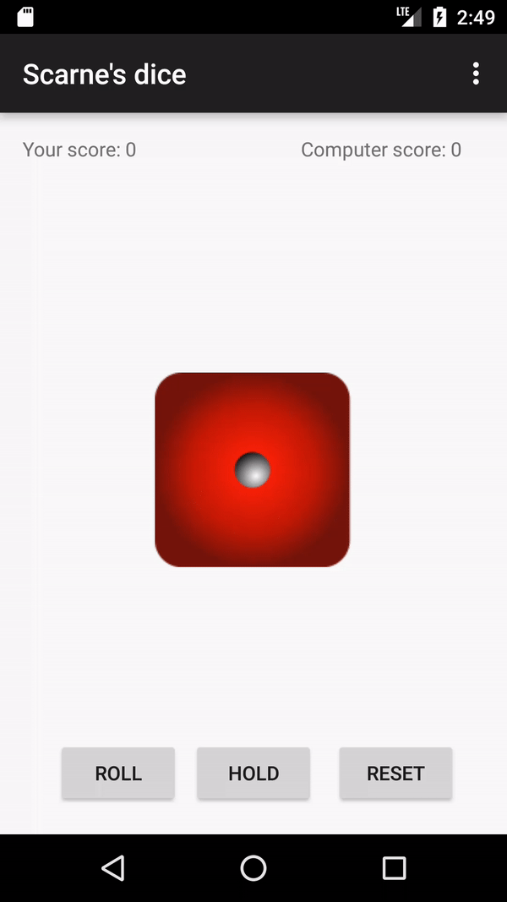

# ScarnesDice
Scarne’s Dice is a turn-based dice game where players score points by rolling a die and then: 
 
if they roll a 1, score no points and lose their turn 
if they roll a 2 to 6: 
add the rolled value to their points 
choose to either reroll or keep their score and end their turn 
 

